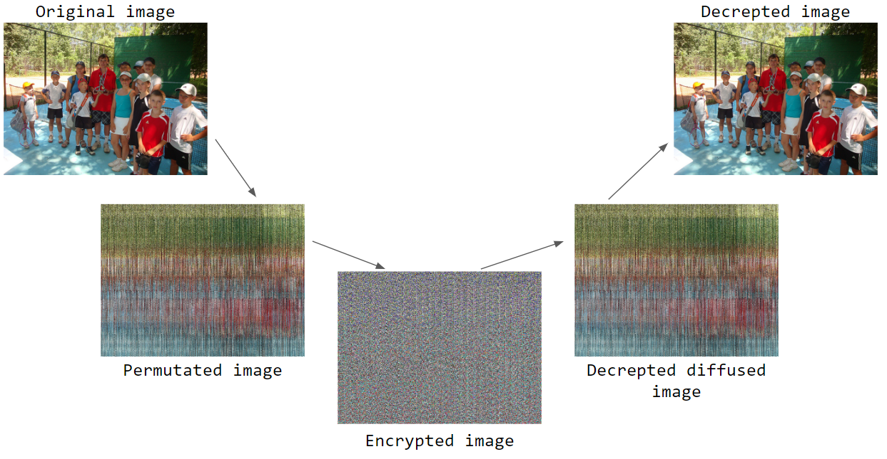

# Image Encryption technique based on chaotic maps
Evaluating the permutation and diffusion operations used in image encryption based on chaotic maps

# To compile program:-

**$g++ -o `${compiled_file}`  `${file_name}`     'pkg-config opencv --cflags --libs'**

eg.

**$g++ -o encryption encryption.cpp 'pkg-config opencv --cflags --libs'**

# To Execute generated binary file:-

**$ ./encryption**

#

In this project a Research Paper is used. [Evaluating the permutation and diffusion operations used in image encryption based on chaotic maps](https://ac.els-cdn.com/S0030402616000279/1-s2.0-S0030402616000279-main.pdf?_tid=8c235cf4-a7bc-41fe-b6bb-e77d9df1f893&acdnat=1537901559_94c0591f3ff0ae3108215529fcabc75d)

**prerequisites:**
  * Basic operations on images
  * Basic knowledge of OpenCV with C++

  Here OpenCv with c++ is not mandatory work environment. You can also choose Matlab or openCv with any language. Main part of this implementation is the algorithm.

# Execution example:

